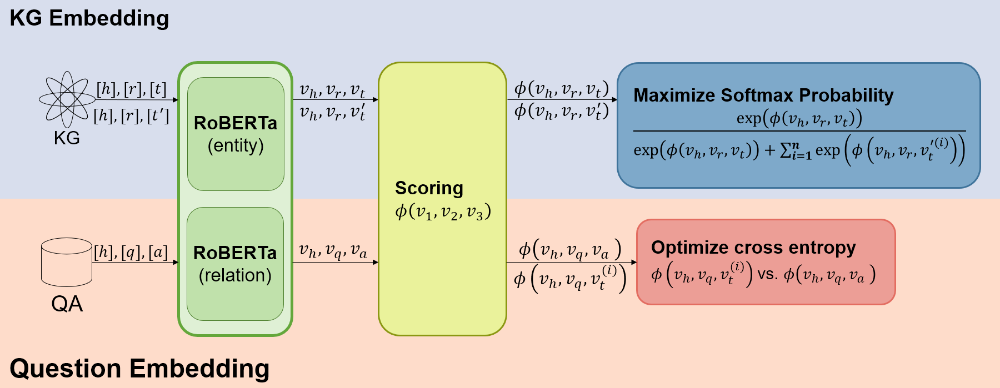
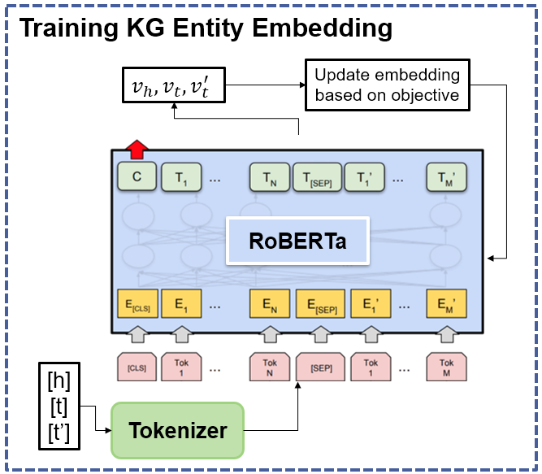

# RoBERTa-KGQA
We present an optimized Knowledge Graph Question Answering (KGQA) algorithm that combines the strengths of the embedding-based KGQA method and the large language model to improve the performance of Knowledge Graph Question Answering tasks. Our model leverages RoBERTa to embed entities and relations and employs a ComplEx-based scoring function for link prediction tasks. We also employed contrastive training to fine-tune the relation embedding module for question-answering tasks.




## Installation

1. To start, install `pytorch` and `cuda` according to your own GPU version, and then create the environment using conda:

    ```sh
    git clone https://github.com/Yuxi-Zhang/RoBERTa-KGQA.git
    cd RoBERTa-KGQA
    conda env create -f environment.yml
    conda activate RoBERTa-KGQA
    ```
The code is tesed with PyTorch==1.13.1 and cuda=11.7
